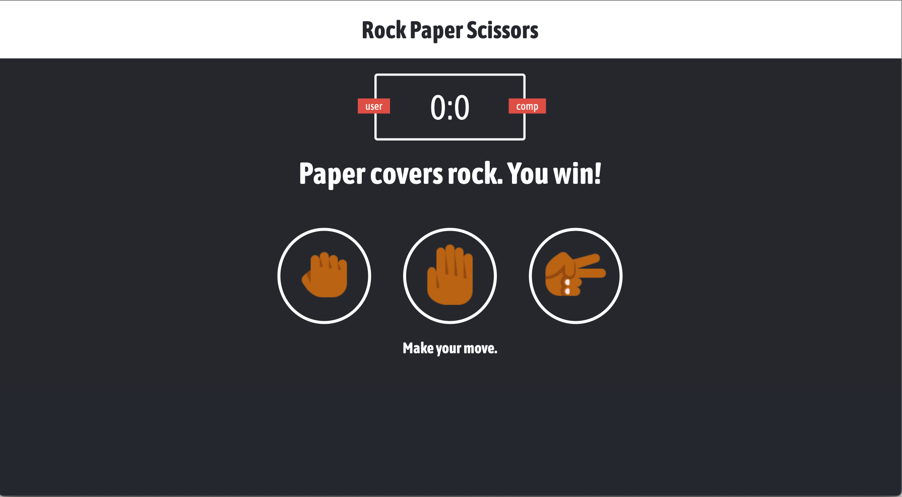

# HTML-CSS-Javascript Rock Paper Scissors game.

## Original project https://www.youtube.com/watch?v=jaVNP3nIAv0&t=1314s ,freeCodeCamp.org(whatsdev) 

### TODO:
* Replace depricated .fontsize and .sub script methods.
* Track and save number of games won.
* Add feature to reset tracking.
* Host github pages.

### icons 
Rock: https://icons8.com/icon/17663/hand-rock
Paper: https://icons8.com/icons/set/small-hand-paper
Scissors: https://icons8.com/icons/set/hand-scissors
